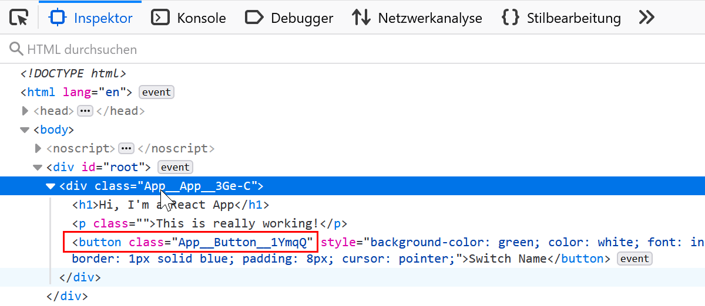

# React Lessons

- https://reactjs.org/
- https://codepen.io/
- https://www.udemy.com/course/react-the-complete-guide-incl-redux

# Table of contents

1. [Introduction](./chapter-1.md)
2. [Next Generation JavaScript](./chapter-2.md)
3. [React Basics](./chapter-3.md)
4. Lists & conditionals
5. Styling React components and elements

# Styling React components and elements

## Approach 1: using Radium

Install *Radium* (inline-styles, pseudo selectors, and media queries) 

~~~shell
C:\Workspace\udemy\react\react-complete-guide> npm install --save radium
~~~

## Approach 2: using Styled Components

_Styled Components_ [Github](https://github.com/styled-components)

~~~shell
npm install --save styled-components
~~~

Use _Styled Components_ like this

~~~js
import styled from 'styled-components';

const Button = styled.button`` // <-- is a template function call! it's a "tagged template literal"
~~~

_Styled Components_ provides regular CSS classes automatically managed.

## Approach 3: using CSS modules (scoped CSS classes)

1. run `npm run eject`
2. adjust the _webpack.config.[dev|prod] accordingly

The result will be something like this

This workflow is also known as _CSS modules_.
