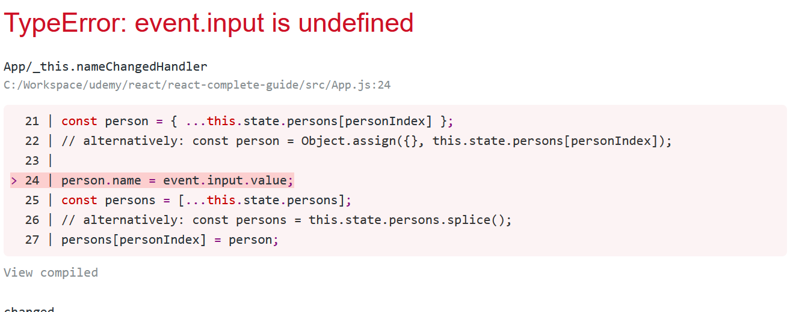
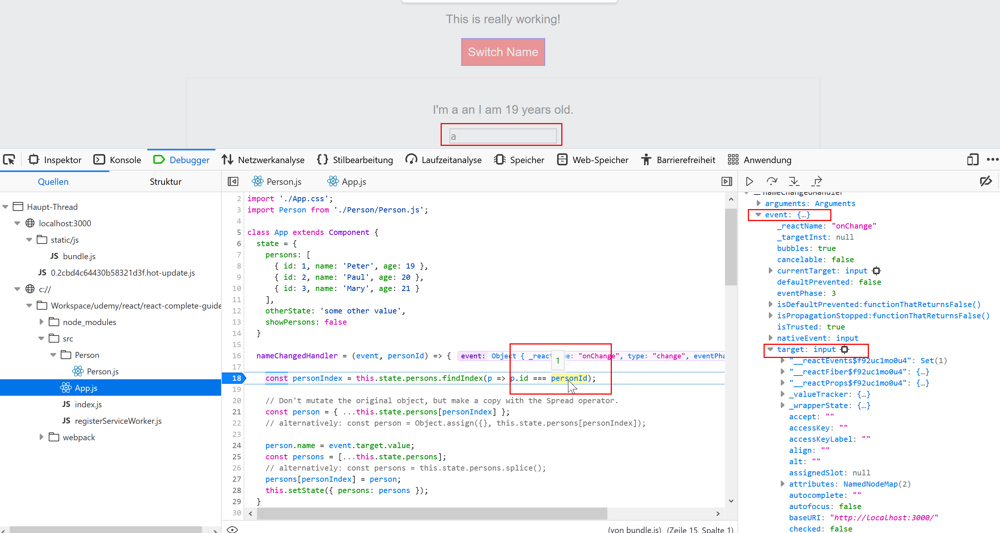

# Debugging React applications

## Understanding error messages

Read the error message and review the code location the error message is pointing at!

## Understanding logic errors

You can use the web developer tools of your browser (Firefox, Chrome, Edge, Safari) to analyze the logic of the source code. This works certainly well when running the code on your local machine.

You should also use the _React Developer Tools_ browser extension which is available in the developer tools after it was installed.

## Use error boundary to catch exceptions and handle them

Use the concept of higher order components as error boundaries.