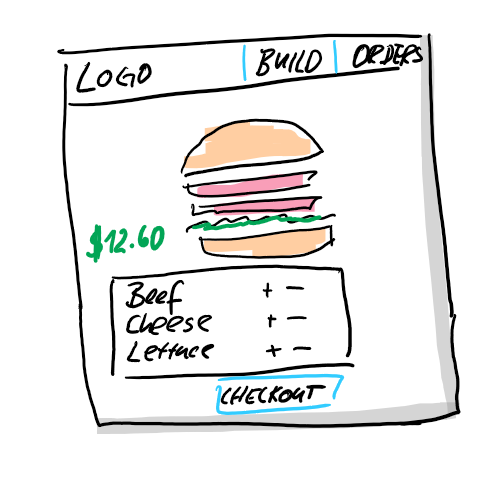
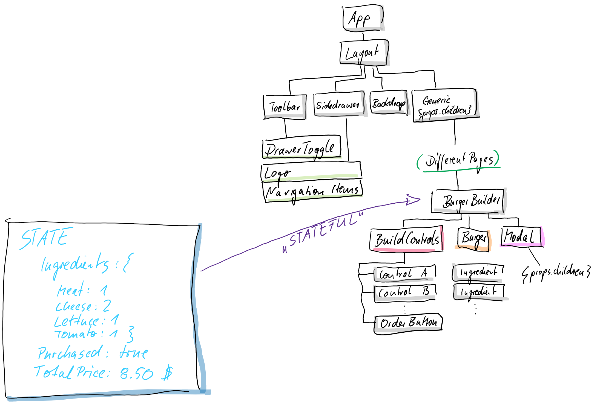
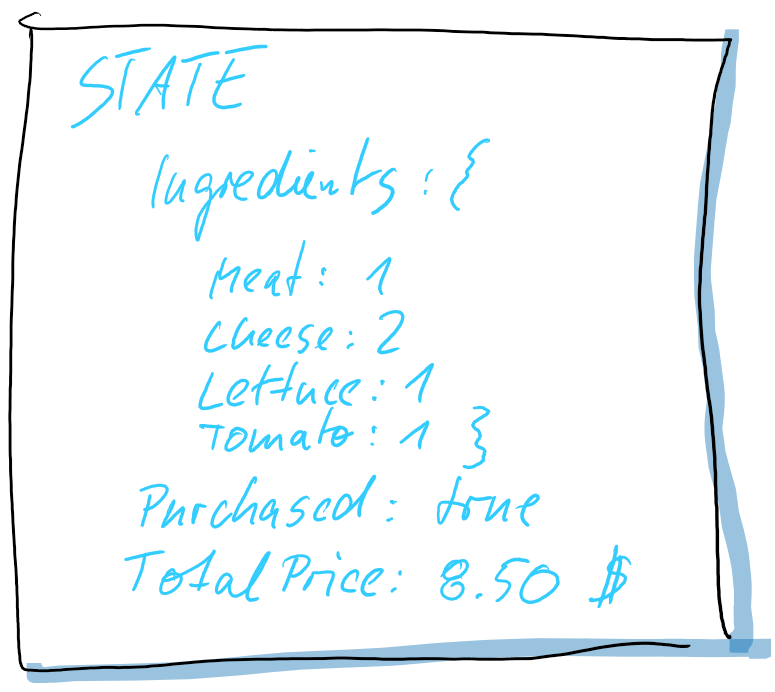

# How to plan a React app?

1. How should the component tree look like? (Structure)
2. Which state should be stored in the app? (Data)
3. Components vs. Containers?

## Wireframe

## Structure

## Data

